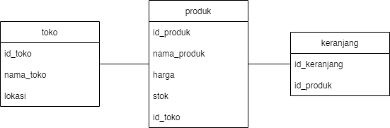

<h1> Simple Marketplace Api </h1>

| Method | Endpoint | Request Body | Response | Description |
| --- | --- | --- | --- | --- |
| GET | /produk/all | - | id_produk, nama_produk, harga, stok, lokasi | Mengambil semua produk yang ada |
| GET | /produk/:produkId | - | id_produk, nama_produk, harga, stok, nama_toko, lokasi | Mengambil detail informasi sebuah produk |
| GET | /keranjang | - | id_keranjang, id_produk, nama_produk, harga, stok, lokasi | Mengambil semua produk yang ada di keranjang |
| POST | /keranjang | id_produk | Sukses/Eror | Menambah produk ke keranjang |
| DELETE | /keranjang/:keranjangId | - | Sukses/Eror | Menghapus produk dari keranjang |
| PUT | /produk/:produkId | - | Sukses/Eror | Mengurangi stok produk sejumlah 1 |

<h1> Requirement utama </h1>
<h2> 1. User bisa checkout barang (masuk ke keranjang) </h2>
Melakukan POST request ke endpoint /keranjang

<h2> 2. User bisa membayar barang (stock produk berkurang) </h2>
Melakukan DELETE request ke endpoint /keranjang/:keranjangId
Melakukan PUT request ke endpoint /produk/:produkId

<h1> Database </h1>

Database menggunakan PostgreSQL
